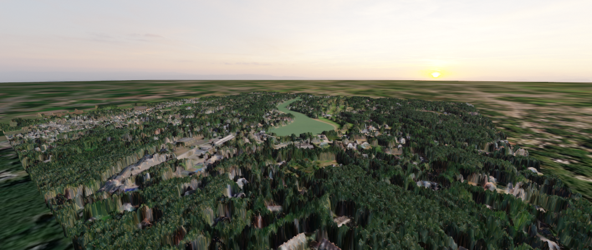
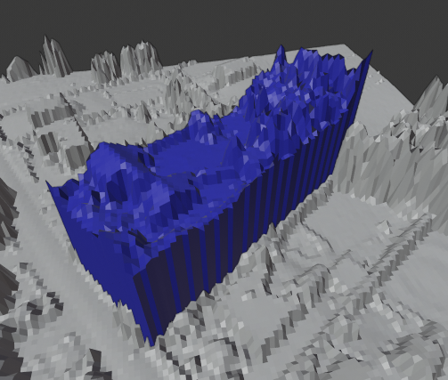
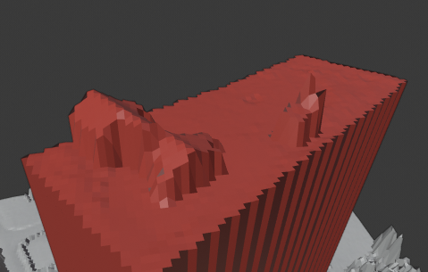
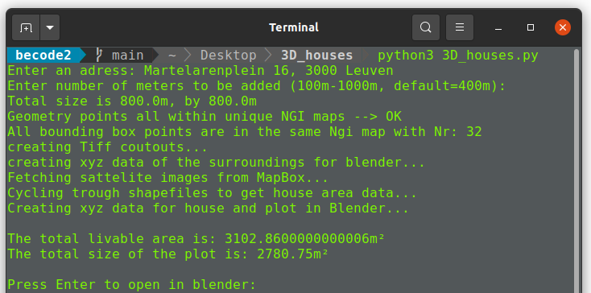

# **3D Houses**

# **2-week Becode challenge:**
We are LIDAR PLANES, active in the Geospatial industry. 
We need you to build a solution with our data to model a house in 3D with only a home address.

# **Description & usage:**
A python terminal program that uses Flemish gov. Lidar data to create 3D models in Blender.

Aside from a 3D model like you see in the image on top you also get the exact size and area of the property and buildings on the piece of land.
 
 
- Needs Mapbox API key for sattelite image overlay
- You need to download following files for it to work:
  - [Percelenplan](https://downloadagiv.blob.core.windows.net/kadastraal-percelenplan-vlaanderen/2021/CadGIS_fiscaal_20210101_GewVLA_Shapefile.zip)
  - [NGI numerieke reeks](https://downloadagiv.blob.core.windows.net/kaartbladversnijding-ngi-numeriek/Kaartbladversnijdingen_NGI_numerieke_reeks_Shapefile.zip)
  - Extract both zip files "as is" into project folder
- Make sure all libraries are installed for 3D_houses.py (Todo: venv)
- Run 3D_houses.py and enter an address (Flanders only)
- The program will tell you which Lidar images you need to download to create a 3D model on that address.
- Alternatively you can try to download all of them at once with this [code](download_geotiffs.ipynb)
- Download them one by one here and extract them into the DSM_tif and DTM_tif folder respecively:
  - [DSM](http://www.geopunt.be/download?container=dhm-vlaanderen-ii-dsm-raster-1m&title=Digitaal%20Hoogtemodel%20Vlaanderen%20II,%20DSM,%20raster,%201m)
  - [DTM](http://www.geopunt.be/download?container=dhm-vlaanderen-ii-dtm-raster-1m&title=Digitaal%20Hoogtemodel%20Vlaanderen%20II,%20DTM,%20raster,%201m)
 
 
- The terminal program:
 

# **Requirements:**
- Linux
- Blender (2.84 tested)
- Python (3.8 tested)

